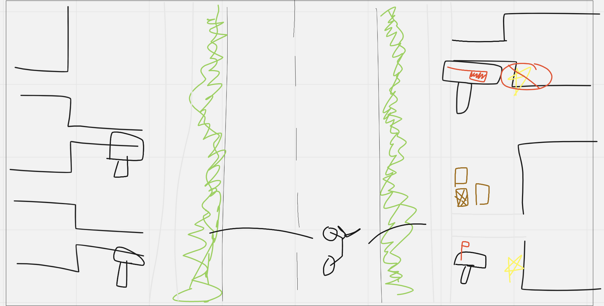

## Newsies Rush

For this project I'd like to re-imagine the classic Paperboy video game!  

___

## About The Game

This game is viewed top-down as you ride through a neighborhood, delivering newspapers to the houses that have signed up, and not delivering to those who didn't want the paper - all while dodging obstacles!  If you give newspapers to people who did not request them, that's a lost profit!  If you throw a newspaper perfectly onto a subscribers doorstep or mailbox, you get a tip from them, increasing your score!  But don't just go as fast as you can - some houses have junk in their yards, some may even have dogs that chase you!

___
## Tech Being Used:

* HTML/CSS - Canvas to play the game

* Javascript

* Bootstrap for styling

___

## MVP Checklist:

* Render a neighborhood - pop up directions and start button

* Randomly select which houses are subscribers and not

* Score money for delivering to correct houses

* Bicycle automatically rides through neighborhood, ability to toss papers left or right

* User has *some* control of x/y location of bike

* Score extra money for delivering the paper *accurately*

* Lose money for delivering to houses that have not subscribed to the newspaper

* Create obstacles in the neighborhood that you can crash into - slowing you down.

___
## Stretch Goals:

* Some houses have pets to chase you

* Multiple difficulties

* Powerups (speed boost, invincible, extra time)

* Traffic

* Bike selection (different stats)

* Graphics overhaul
